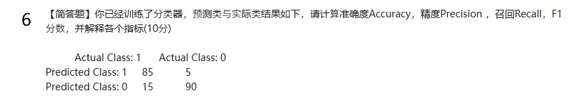

## 全文答案由GPT3.5提供，内容可能有误，请自行甄别

### 1. KNN算法思想和主要步骤？

1. 选择K值：
2. 计算距离：
3. 找到最近的邻居：
4. 进行分类或回归：
5. 模型评估：
6. 参数调优：

### 2. ID3算法思想：

信息增益的概念：

分裂准则：

递归分裂：

### 3. ID3算法生成决策树的步骤：

1. 输入：训练数据集
2. 选择最佳分裂特征：
3. 分裂数据集：
4. 递归构建子树：
5. 停止条件：
6. 输出：

### 4. 四个指标

四个指标答案为：
0.897，0.944，0.85，0.894
1. 准确度（Accuracy）：模型预测正确的样本占总样本数的比例。
2. 精度（Precision）：在所有预测为正类的样本中，实际为正类的比例。
3. 召回（Recall）：在所有实际为正类的样本中，被正确预测为正类的比例
4. F1分数：精度和召回的调和平均数，综合考虑了模型的准确率和召回率。

### 5. 线性回归最小二乘法和拟合步骤

1. 定义模型：
2. 定义损失函数：
3. 最小化损失函数：
4. 梯度下降法的步骤：
5. 评估模型：

### 6. CNN可以应用到哪些领域

1. 图像分类：
2. 目标检测：
3. 语义分割：
4. 人脸识别：
5. 图像生成：
6. 医学图像分析：
7. 自动驾驶：
8. 自然语言处理中的应用：

### 7. 降维的目的是什么PCA算法思想以及流程

目的：

1. 简化模型
2. 去除冗余信息
3. 数据可视化
4. 防止过拟合

PCA:

1. 数据标准化：
2. 计算协方差矩阵：
3. 计算特征值和特征向量：
4. 选择主成分：
5. 数据投影：

### 8. 深度神经网络避免过拟合的方法有以下几种：

1. 正则化
2. 数据增强

### 9. 输入图片大小为32×32，依次经过一层卷积(kernel size 5×5，padding 0，stride 1)，得到特征图大小为____，pooling(kernel size 2×2，padding 0，stride2)，得到特征图大小为____，又一层卷积(kernel size 5×5，padding 0，stride 1)之后，输出特征图大小为____。

第一层卷积后特征图大小为 28×28。

池化后特征图大小为 14×14。

第二层卷积后特征图大小为 10×10。

### 10. 在线性回归中，我们的假设，我们使用m来表示训练示例的数量。

x y

3 2

1 2

0 1

4 3

对于上面给出的训练集(注意，此训练集也可以在本测验的其他问题中引用)，m的值是____。对代价函数的定义是，求出为___。假设，求得为____。

答案：

4

3/8

11

### 11. 2*2池化
四个空分别为

3.25  
5.25
2
2

### 12. 三种常见的监督学习算法：

1. 线性回归
2. 决策树
3. 支持向量机

### 13. 人工智能研究中，____图灵测试___测试常被用来评估机器是否具有人类智能。

### 14. 深度学习中非线性激活函数有____等。

1. ELU 函数
2. ReLU 函数
3. Sigmoid 函数

### 15. 使用的是一个线性SVM分类器，是用来解决存在的2分类问题。现在你已经获得了以下数据，其中一些点用红色圈起来表示支持向量。从数据中删除以下任何一个红点。决策边界__会__改变。从数据中删除非红色圆圈点，决策边界__不会__发生变化

### 16. 输入图片大小为39×39，依次经过一层卷积(kernel size 3×3，padding 0，stride 1)，得到特征图大小为____，又一层卷积(kernel size 5×5，padding 0，stride 2)，得到特征图大小为____，又一层卷积(kernel size 5×5，padding 0，stride 2)之后，输出特征图大小为____。

37×37

17×17。

7×7

### 17. 在机器学习中，数据常常被分为____集____集____集三部分

训练集、验证集和测试集

### 18. 【填空题】输入图片大小为32×32，依次经过一层卷积(kernel size 5×5，padding 0，stride 1)，得到特征图大小为____，pooling(kernel size 2×2，padding 0，stride2)，得到特征图大小为____，又一层卷积(kernel size 5×5，padding 0，stride 1)之后，输出特征图大小为____。

- 28×28。
- 14×14。
- 10×10。

### 19. 假设有m=14个训练示例，有n=3个特性(不包括需要另外添加的恒为1的截距项)，正规方程是。对于给定m和n的值，这个方程中的维数分别是____【1】【2】【3】____________

4

4

4

### 20. 列举三种你熟悉的分类算法__________。

支持向量机

决策树

随机森林

### 21. 列举三种你熟悉的深度学习算法__【3】__，【4】__，【5】。

卷积神经网络

循环神经网络

生成对抗网络

### 22. 在机器学习中需要划分数据集，常用的划分测试集和训练集的划分方法有____。(至少填两种)

随机划分

分层划分

### 23. 通过模拟生物神经元网络结构和功能的计算模型被称为________。

神经网络模型

### 24. 支持向量机SVM分类器，常用的核函数有____、____。

线性核函数

非线性核函数

### 25. 简述机器学习的定义和实现步骤

定义：

让计算机系统从数据中学习并改进，而不需要显式编程的技术

步骤：

数据收集

**选择模型**：

训练模型

模型评估

模型调优

模型部署应用·

监控和维护

### 26.  LSTM为什么比RNN好?

长期依赖性处理能力

记忆单元

遗忘门

输入和输出门

适用性广泛性

### 27.  SVM算法定义和实现步骤

定义： 是一种强大的监督学习算法，用于解决分类和回归问题。

- **数据准备**：
- **选择核函数**：
- **模型训练**：
- **模型评估**。
- **超参数调优**：
- **模型应用**：

### 28. 线性回归和逻辑回归区别和联系

区别：

应用领域

输出类型

模型形式

联系：

**线性关系**：

**参数估计**：

模型评估

### 29. LDA算法思想和实现步骤

思想：

**生成模型假设**：

参数定义

**推断过程**：

实现：

**准备数据**：

构建词袋模型

**设定参数**：

**初始化变量**：

**迭代优化**：

**模型评估**：

**应用和解释**：

### 30. 请阐述决策树算法的思想挘及为下面对话构建一棵决策树:

